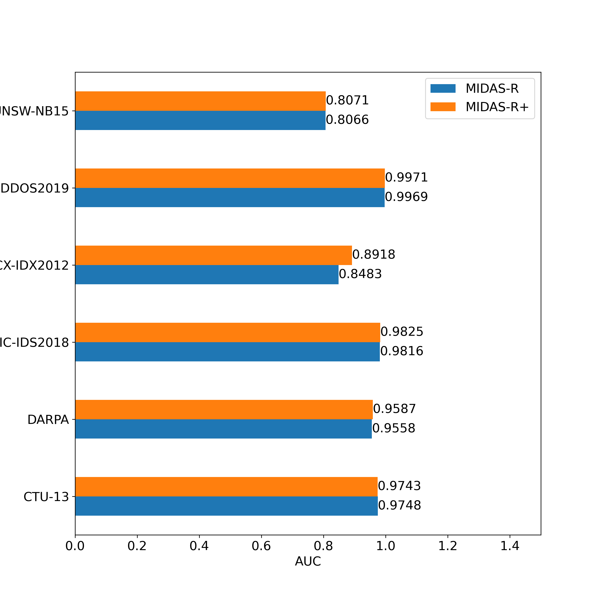
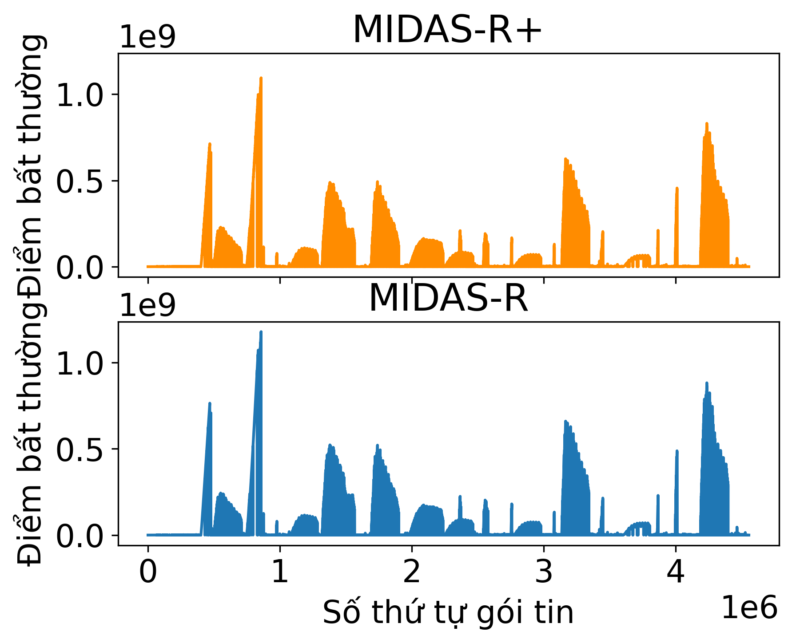
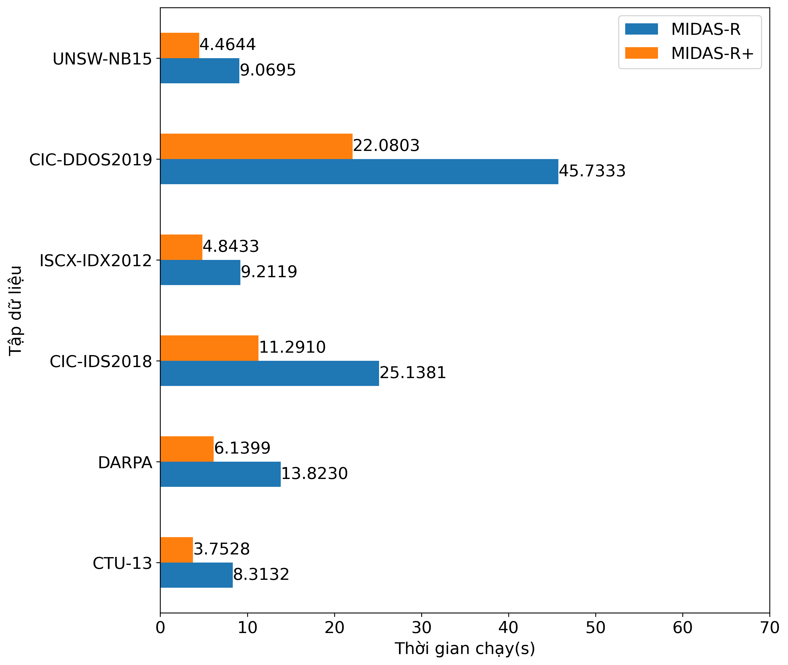

# Cải thiện hiệu năng thuật toán phát hiện bất thường MIDAS-R trong an ninh mạng

Tìm cách nâng cao hiệu năng trong khi vẫn đảm bảo độ chính xác của thuật toán [MIDAS](https://github.com/Stream-AD/MIDAS) bằng các áp dụng các kỹ thuật và nghiên cứu sau:
1. [NitroSketch](https://dl.acm.org/doi/10.1145/3341302.3342076): khung nhằm giải quyết một cách có hệ thống các tắc nghẽn về hiệu năng của các bản phác thảo.
2. [Enhanced double hashing](http://peterd.org/pcd-diss.pdf): kỹ thuật sinh nhiều giá trị băm hiệu quả với chỉ ít lần băm.
3. [SIMD](https://en.wikipedia.org/wiki/Single_instruction,_multiple_data): kỹ thuật lập trình sử dụng khả năng tính toán song song của CPU.
4. Caching: kỹ thuật lập trình nhằm giảm thiểu phân bổ bộ nhớ.
5. [Median of medians](https://en.wikipedia.org/wiki/Median_of_medians#:~:text=In%20computer%20science%2C%20the%20median,approximate%20median%20in%20linear%20time.): thuật toán tìm trung vị với độ phức tạp thuật toán tốt hơn các truyền thống.
6. Lựa chọn cấu hình tối ưu cho Sketch
7. Branchless Programming: kỹ thuật lập trình giảm thiểu rẽ nhánh trong chương trình.

## Kết quả

